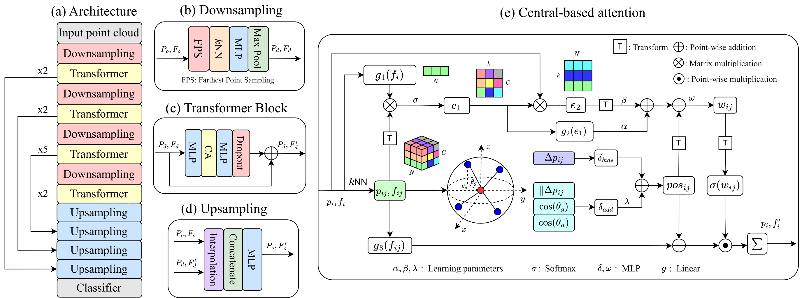

# PointCT: Point Central Transformer Network for Weakly-supervised Point Cloud Semantic Segmentation
*Anh-Thuan Tran,  Hoanh-Su Le,  Suk-Hwan Lee,  Ki-Ryong Kwon*

This is the official PyTorch implementation of our paper [**PointCT: Point Central Transformer Network for Weakly-supervised**](https://openaccess.thecvf.com/content/WACV2024/html/Tran_PointCT_Point_Central_Transformer_Network_for_Weakly-Supervised_Point_Cloud_Semantic_WACV_2024_paper.html) that has been accepted to WACV 2024. [\[CVF\]](https://openaccess.thecvf.com/content/WACV2024/papers/Tran_PointCT_Point_Central_Transformer_Network_for_Weakly-Supervised_Point_Cloud_Semantic_WACV_2024_paper.pdf)

<div align="center">
  
</div>

# Highlight 
1. We propose a novel end-to-end trainable transformer network with **central-based attention** to overcome sparse annotations in point cloud segmentation.
2. We introduce position encoding module in point cloud weak supervision, concentrating on different geometric components to extract point representations and improve model spatial reasoning.
3. Our experimental results on benchmark datasets demonstrate the outstanding performance of *PointCT* compared to state-of-the-art studies for both indoor and real-world point clouds.

# Get Started
## Dependencies
- Ubuntu: 20.04
- Python: 3.7
- PyTorch: 1.10.1 
- CUDA: 11.3
- Hardware: 2 GPUs (NVIDIA RTX 3060) to reproduce [PointCT](https://openaccess.thecvf.com/content/WACV2024/papers/Tran_PointCT_Point_Central_Transformer_Network_for_Weakly-Supervised_Point_Cloud_Semantic_WACV_2024_paper.pdf) 

## Environment

1. Install dependencies

```
pip install torch==1.10.1+cu113 torchvision==0.11.2+cu113 torchaudio==0.10.1 -f https://download.pytorch.org/whl/cu113/torch_stable.html

pip install -r requirements.txt
```

2. Compile pointops

Make sure you have installed `gcc` and `cuda`, and `nvcc` can work (Note that if you install cuda by conda, it won't provide nvcc and you should install cuda manually.). Then, compile and install pointops as follows.
```
cd lib/pointops
python3 setup.py install
```

## Datasets Preparation

### S3DIS
Please refer to https://github.com/yanx27/Pointnet_Pointnet2_pytorch for S3DIS preprocessing. Then modify the `data_root` entry in the .yaml configuration file.

### ScanNetv2
Please refer to https://github.com/dvlab-research/PointGroup for the ScanNetv2 preprocessing. Then change the `data_root` entry in the .yaml configuration file accordingly.

### STPLS3D
Please refer to https://github.com/meidachen/STPLS3D/tree/main/point-transformer for STPLS3D preprocessing. Then modify the `data_root` entry in the .yaml configuration file.

## Training
For testing, first check the `save_path`, `resume` and `labeled_point` (if applicable) accordingly. Then, run the following command.

[CONFIG] = config/s3dis.yaml, config/scannet.yaml, config/stpls3d.yaml
```
python3 train.py --config [CONFIG]
```

Note: It is normal to see the the results on S3DIS fluctuate between -0.5\% and +0.5\% mIoU maybe because the size of S3DIS is relatively small, while the results on ScanNetv2 and STPLS3D are relatively stable.

## Testing
For testing, first change the `model_path`, `save_folder` and `data_root_val` (if applicable) accordingly. Then, run the following command. 

For S3DIS, STPLS3D test set and ScannetV2 validation set, we use following command.

[CONFIG] = config/s3dis.yaml, config/scannet.yaml, config/stpls3d.yaml
```
python3 test.py --config [CONFIG]
```
For benchmark ScannetV2 test set, we use following command.
```
python3 test_scannet.py --config config/scannet.yaml
```
# Citation
If you find this project useful, please consider citing:

```
@inproceedings{tran2024pointct,
  title        = {{PointCT}: Point Central Transformer Network for Weakly-Supervised Point Cloud Semantic Segmentation},
  author       = {Anh{-}Thuan Tran and
                  Hoanh{-}Su Le and
                  Suk{-}Hwan Lee and
                  Ki{-}Ryong Kwon},
  booktitle    = {Proceedings of the {IEEE/CVF} Winter Conference on Applications of Computer Vision},
  pages        = {3556--3565},
  year         = {2024},
}
```

## Acknowledgement
We refer [Point Transformer](https://github.com/POSTECH-CVLab/point-transformer) and [Stratified Transformer](https://github.com/dvlab-research/Stratified-Transformer) for our codebase.